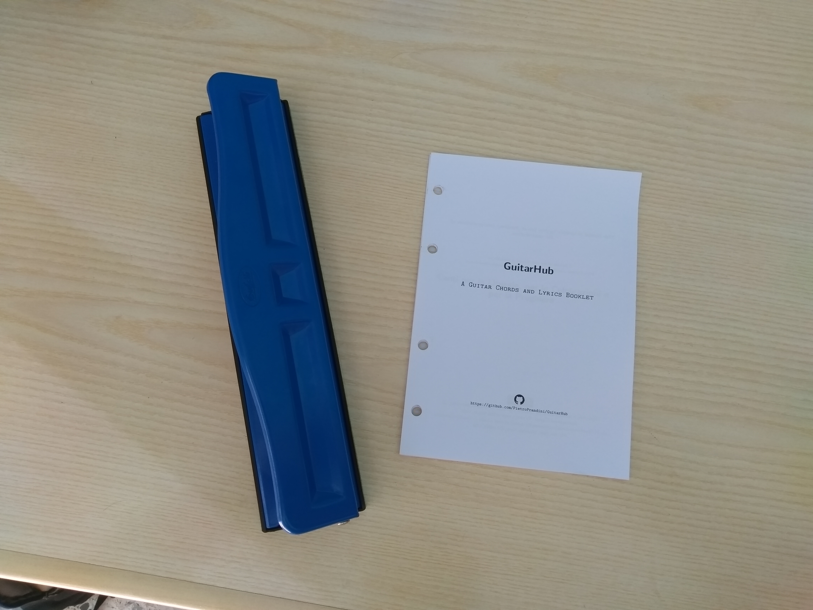

# Print the GuitarHub booklet
## Download the ToPrint version
Download the booklet:
* [GuitarHubAlphabeticNoteNamesToPrint.pdf](https://github.com/PietroPrandini/GuitarHub/blob/master/ToPrint/GuitarHubAlphabeticNoteNamesToPrint.pdf)
* [GuitarHubLyricsToPrint.pdf](https://github.com/PietroPrandini/GuitarHub/blob/master/ToPrint/GuitarHubLyricsToPrint.pdf)
* [GuitarHubSolfegeNoteNamesToPrint.pdf](https://github.com/PietroPrandini/GuitarHub/blob/master/ToPrint/GuitarHubSolfegeNoteNamesToPrint.pdf)
## Print it
Print the downloaded file with these settings:

## Make it
##### Cut each page into two equal parts like this:

##### Make holes like these on every sheet:

##### Assemble them into the GuitarHub booklet.

## Rock it
Now be a new GuitarHub hero!

