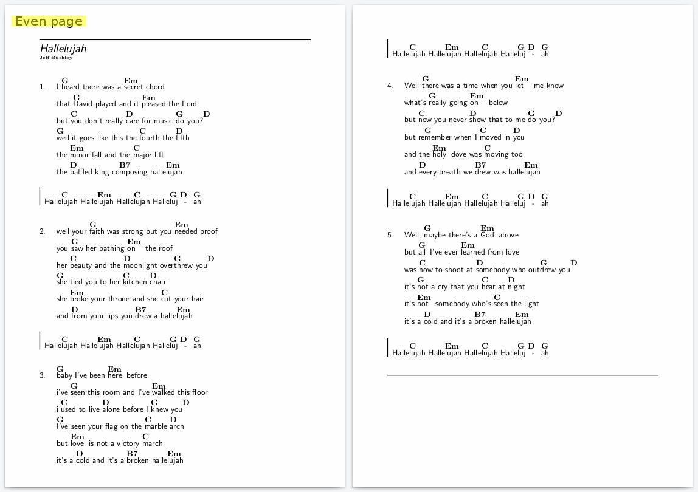
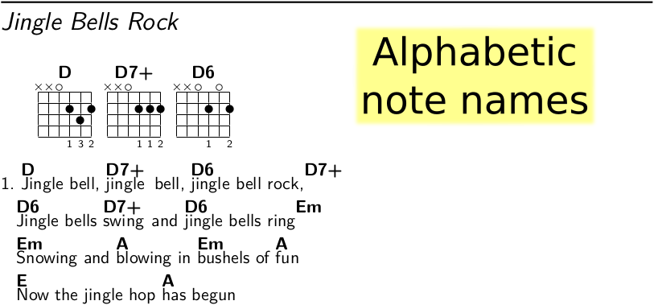
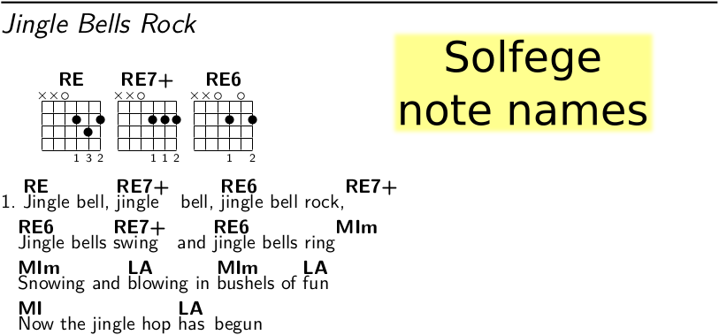
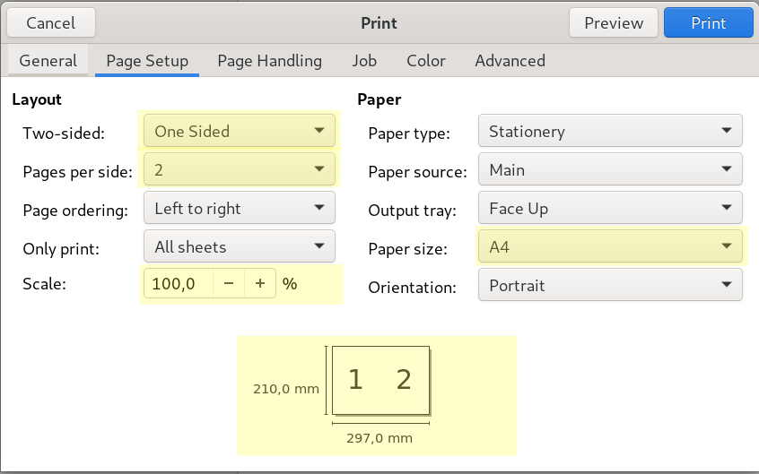
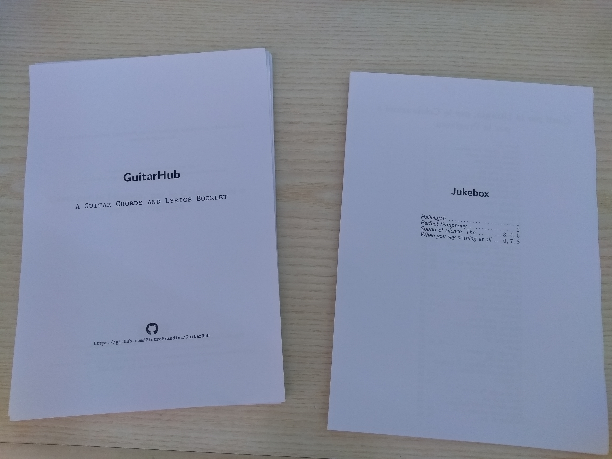
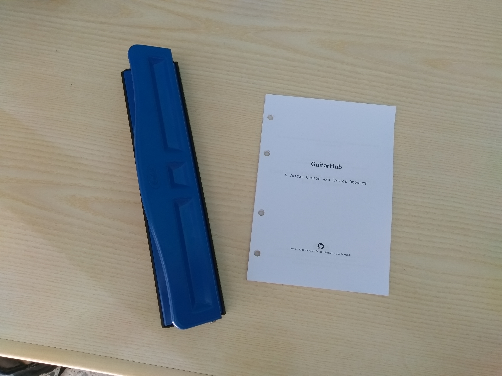
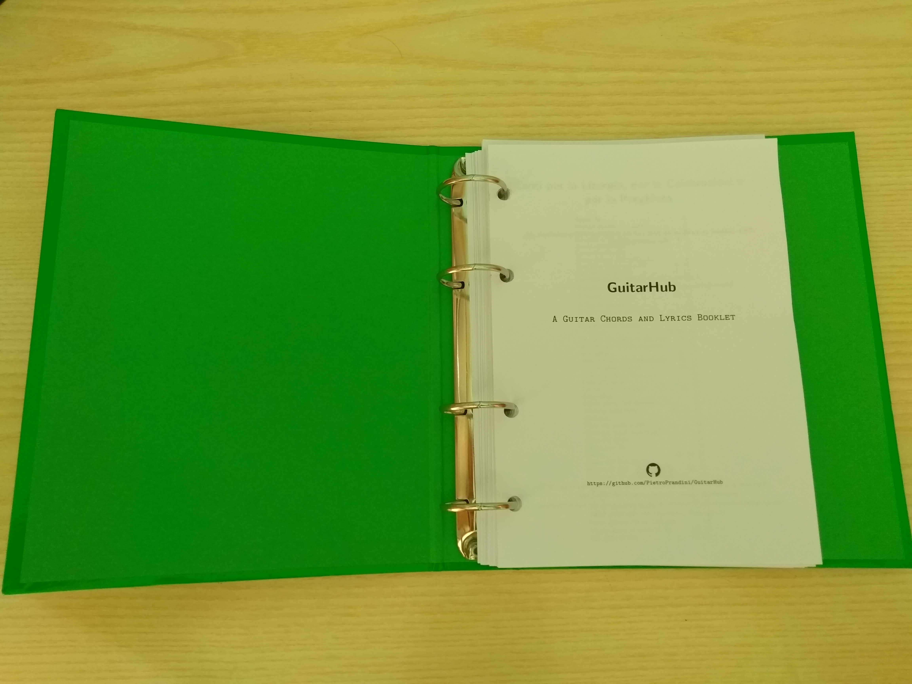

# GuitarHub
A guitar chords and lyrics booklet.

## Purpose
The primary aim of this project is to create a printable booklet with guitar chords.

## Considerations
This book is meant mainly for the guitar players that would like to have a chords book that is updated periodically without the losage of formatting and any other related problems.
It is highly recommended to print the content of this booklet and put it in a ring notebook - when a new song is added you can print it out and add it to a desired location. In order to avoid inconsistencies in adding new songs to your collection, songs are not labeled with any numbers. You can, for example, order the songs alphabetically.

## Features
* The booklet is available to be printed at once, including all the songs till date. Then you can expand it by adding the newly released songs without the necessity to reprint the whole booklet.
* The format of a single sheet is ISO A5 which supports the idea of  portability.
* Each song uses at most 2 pages whilst the first page would always be an even number in such case: you haven't got any problem about reading it.  

* Write the song with alphabetic note names and then you can generate that song in both alphabetic and solfege note names without rewriting it. 
 
* Easy automatic transpositions of the chords.
* You are welcome to add your favourite songs with a pull request.
* The book is licensed by a Free Culture License.
* There is a simple template to support the writing of the song (*src/SongTemp.tex*).
* There is a script (*src/GuitarHubGenerator.sh*) that generate every booklets in the main folder of GuitarHub.

## Getting started
If you would like to have a printed version of the booklet you could:
### Download it
Download the booklet format of GuitarHub:
* [GuitarHubAlphabeticNoteNamesBooklet.pdf](https://github.com/PietroPrandini/GuitarHub/blob/master/GuitarHubAlphabeticNoteNamesBooklet.pdf)
* [GuitarHubLyricsBooklet.pdf](https://github.com/PietroPrandini/GuitarHub/blob/master/GuitarHubLyricsBooklet.pdf)
* [GuitarHubSolfegeNoteNamesBooklet.pdf](https://github.com/PietroPrandini/GuitarHub/blob/master/GuitarHubSolfegeNoteNamesBooklet.pdf)
### Print it
Print the downloaded copy with these settings:

### Make it
##### Divide every sheet in two equally parts like this:

##### Make some holes like these on every sheets:

##### Assemble them into the GuitarHub booklet.

### Rock it
Now you could be a GuitarHub hero.
You could share it with your frinds, you could add some songs, you could rock with it.
Thanks in advance for your heroism.

#### Note
If you would have the books without a page settings like a booklet you can find them here:
* [GuitarHubAlphabeticNoteNames.pdf](https://github.com/PietroPrandini/GuitarHub/blob/master/GuitarHubAlphabeticNoteNames.pdf)
* [GuitarHubLyrics.pdf](https://github.com/PietroPrandini/GuitarHub/blob/master/GuitarHubLyrics.pdf)
* [GuitarHubSolfegeNoteNames.pdf](https://github.com/PietroPrandini/GuitarHub/blob/master/GuitarHubSolfegeNoteNames.pdf)

## For Developers
This project would be a community project: you are welcome to participate to it.

### Tools
The GuitarHub booklets are written in [LaTex](https://www.latex-project.org/) with the use of the [Songs package](http://songs.sourceforge.net/).

#### A Latex environment
[Guide about the installation process of the LaTex environment](https://www.latex-project.org/get/)

#### The Songs package
[Guide about the installation process of the Songs package](http://songs.sourceforge.net/downloads.html)

#### Arara: the cool Tex automation Tool
[Arara](https://github.com/cereda/arara) is useful to generate easily the booklets and particularly the indexes.
If you would use arara you have to have properly installed the songs package and you have to pay attiontion for the rule of songidx (an example of this rule that works with texlua is in [src/songidx.yaml](https://github.com/PietroPrandini/GuitarHub/blob/master/src/songidx.yaml))

#### A text editor or an IDE specific for LaTex documents
A [text editor](https://en.wikipedia.org/wiki/Text_editor) or an IDE specific for LaTex document is useful to edit songs and the code of this book.
There are many text editors ([Atom](https://atom.io/), [Vim](https://www.vim.org/), [Emacs](https://www.gnu.org/software/emacs/)) and many IDE for LaTex ([Texmaker](http://www.xm1math.net/texmaker/), [TeXstudio](https://sourceforge.net/projects/texstudio/), [TeXworks](https://www.tug.org/texworks/)) but you can use the ones you prefer.

### Procedures
#### Setup a new chapter
*Note: if you would like to add a new song to an existing chapter you can skip the setting up of a new chapter.*
This booklet could have many chapters.
Every chapter has a directory in src/tex/ directory and an input .tex file, both named with its name.
The directory contain the songs files of the chapter and the input .tex file add them to the booklets.
If you would like to create a new chapter you have to create them.
Then you have to declare it to the src/GuitarChordsPreamble.tex.
Finally you can add every songs of the new chapter to the booklet in src/GuitarHubBody.tex.
##### Creating a new chapter, an example:
###### *Creating* the chapter directory and the input .tex file:
Open a terminal and then create them in /path/to/GuitarHub/src/tex/
```
$ cd /path/to/GuitarHub/src/tex/
$ mkdir newChapter
$ touch newChapter.tex
```
###### *Declaring* the chapter in the src/GuitarChordsPreamble.tex:
Open src/GuitarChordsPreamble.tex with a text editor and declare it
```
%...
%	Indexes
%...
\newindex{newChapter}{newChapter} %new chapter declared
%...
```
###### *Adding* the song chapter to the booklet:
Open src/GuitarChordsBody.tex with a text editor and add it
```
\begindocument
%...
%	New chapter
%	Start on a right page and the title is in a blank page
\checkodd
\vspace*{\stretch{3}}
\songchapter{New Chapter} % full name of the new chapter
\vspace*{\stretch{5}}
\newpage
%	Songs of this chapter
\begin{songs}{newChapter} % name declared in src/GuitarChordsPreamble.tex
	\input{tex/newChapter.tex} % input file .tex of the new chapter
\end{songs}
%...
```

#### Add a new song
Every song is associated to an existing chapter, if the chapter doesn't exist firstly you have to setup it.
To support the writing of new song it is provided a template: *SongTemp.tex*.
You don't need any special skills to write a song with this template.
You can find it in the src/ directory and you could copy it to the chapter of the new song.
Then you have to rename it with the name of the new song.
Now it's the time for declaring it in the input .tex file of the chapter you would add the this song.
Finally you can write it.
##### Creating a new song, an example:
###### *Copying* the SongTemp.tex from src/ to the directory of the chapter you would like to add the song:
```
$ cd ./GuitarHub/src/
$ cp SongTemp.tex tex/chapterName/
```
###### *Renaming* the copy with the title name of the new song
```
$ mv "tex/chapterName/SongTemp.tex" "tex/chapterName/Title song.tex"
```
###### *Adding* the song in the chapter input file
```
$ echo '\input{"tex/chapterName/Title song.tex"}' >> tex/chapterName.tex
```
*Warning: this command is an example, it isn't put the song by alphabetical order.*

### Generate the booklets
When you add some songs to GuitarHub structure, you have to generate the booklets.
With the script src/GuitarHubGenerator.sh you can generate every booklets easily with only a command.
Otherwise if you prefer you can generate these manually.
#### Generating the booklets with GuitarHubGenerator.sh, an example:
```
$ cd /path/to/GuitarHub/src/
$ sh GuitarHubGenerator.sh
```
This produce the guitar chord booklet with alphabetic note names, the lyrics booklet and the guitar chord booklet with solfege note names and every of these in single pages ISO A5 and in the booklet page settings ISO A4 in /path/to/GuitarHub/ .
Note: this script works with [arara, the cool Tex automation tool,](https://github.com/cereda/arara) and the [songs package](http://songs.sourceforge.net/) properly installed (pay attention for the rule of songidx, an example of it that works with texlua is in [src/songidx.yaml](https://github.com/PietroPrandini/GuitarHub/blob/master/src/songidx.yaml)).
#### Generating the booklets manually, an example:
##### with arara
You can find the commands in src/GuitarHubGenerator.sh.

##### without arara
* Open a terminal and change the directory
```
$ cd /path/to/GuitarHub/src/
```
* First compiling (generate some files useful for make the indexes)
```
$ pdflatex GuitarHubAlphabeticNoteNamesBooklet.tex
```
* Generate the indexes (repeat this point for every chapters)
```
$ texlua /usr/local/share/songs/songidx.lua "chapterName.sxd"
```
* Final compiling (add the generated indexes)
```
$ pdflatex GuitarHubAlphabeticNoteNamesBooklet.tex
```
* Move the generated .pdf of the booklets to the root directory of the project
```
$ mv GuitarHubAlphabeticNoteNamesBooklet.pdf ../GuitarHubAlphabeticNoteNamesBooklet.pdf
```
*Note: repeat this points for every type of the GuitarHub booklets*
