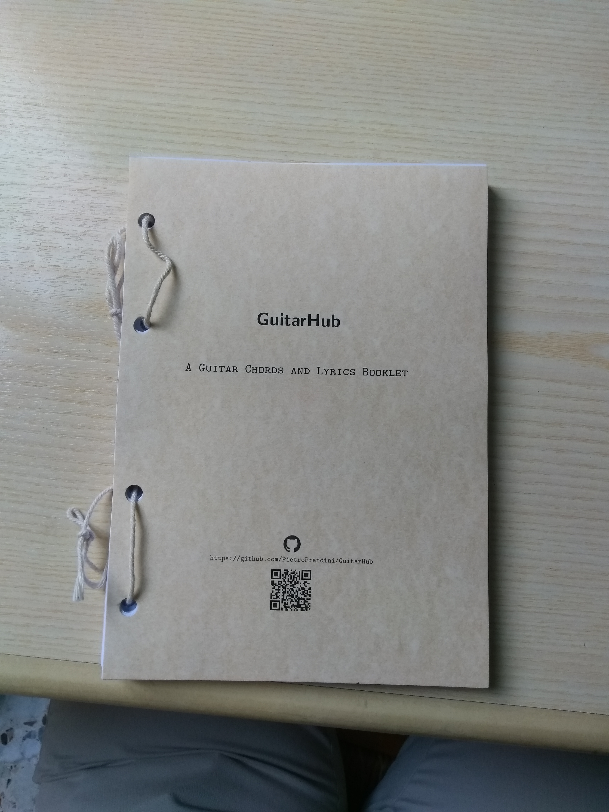

# GuitarHub
A guitar chords and lyrics booklet.


## Purpose
The primary aim of this project is to create a printable guitar chords booklet for everyone.  
This booklet provides a lot of possibilities: you can update it with new songs without reprinting the whole book, you can share this booklet with your friends, you can use it for bringing the music to every street of the world, or rather, you can become a GuitarHub hero.  
Thank you for using this booklet.  
Thank you for sharing it.  
Thank you for becoming a GuitarHub hero.  

## Considerations
This book is meant mainly for the guitar players who would like to have a chords book that is updated periodically without the loss of formatting and any other related problems.  
It is highly recommended to print the content of this booklet and put it in a ring notebook - when a new song is added you can print it out and place it in a desired location. In order to avoid inconsistencies when adding the new songs to your collection, the pages are not labeled with any numbers. You can, for example, order the songs alphabetically.  

## Features
* the booklet is available to be printed at once, including all the songs till date and then you can expand it by adding the newly released songs without the necessity to reprint the whole booklet;
* the format of a single page is ISO A5 which supports the idea of  portability;
* each song starts at a page with an even number to support the updating process;
* creating songs with musical note names in both absolute and solfege systems;

 
* easy and automatic transposition of the chords;
* ability to add your favourite songs;
* the book is licensed by a Free Culture License;
* support for creating songs;
* support for generating the booklets.

## Getting started
Should you like to have a hard copy of the booklet you can:
### Download it
Download the booklet:
* [GuitarHubAlphabeticNoteNamesBooklet.pdf](https://github.com/PietroPrandini/GuitarHub/blob/master/FormattedAsBooklet/GuitarHubAlphabeticNoteNamesBooklet.pdf)
* [GuitarHubLyricsBooklet.pdf](https://github.com/PietroPrandini/GuitarHub/blob/master/FormattedAsBooklet/GuitarHubLyricsBooklet.pdf)
* [GuitarHubSolfegeNoteNamesBooklet.pdf](https://github.com/PietroPrandini/GuitarHub/blob/master/FormattedAsBooklet/GuitarHubSolfegeNoteNamesBooklet.pdf)
### Print it
Print the downloaded file with these settings:

### Make it
##### Cut each page into two equal parts like this:

##### Make holes like these on every sheet:

##### Assemble them into the GuitarHub booklet.

### Rock it
Now be a new GuitarHub hero!

#### Note
If you would have a book without a page setting like in the booklet you can find them here:
* [GuitarHubAlphabeticNoteNames.pdf](https://github.com/PietroPrandini/GuitarHub/blob/master/GuitarHubAlphabeticNoteNames.pdf)
* [GuitarHubLyrics.pdf](https://github.com/PietroPrandini/GuitarHub/blob/master/GuitarHubLyrics.pdf)
* [GuitarHubSolfegeNoteNames.pdf](https://github.com/PietroPrandini/GuitarHub/blob/master/GuitarHubSolfegeNoteNames.pdf)

## For Developers
This project is a community project: you are welcome to participate in it.

### Tools
The GuitarHub booklets are written in [LaTex](https://www.latex-project.org/) with the use of the [Songs Package](http://songs.sourceforge.net/).

#### The LaTex environment
[Guide to installing the environment](https://www.latex-project.org/get/)

#### The Songs Package
[Guide to installing the Songs Package](http://songs.sourceforge.net/downloads.html)

#### Arara
[Arara](https://github.com/cereda/arara) is useful to easily generate the booklets and especially the indexes.
Should you wish to use Arara you need to have properly installed the Songs Package as well as pay close attention to the rule of songidx (an example of how this rule works with texlua is presented in [src/songidx.yaml](https://github.com/PietroPrandini/GuitarHub/blob/master/src/songidx.yaml).

#### A text editor or an IDE specific for LaTex documents
A [text editor](https://en.wikipedia.org/wiki/Text_editor) or an IDE specific for LaTex documents are is useful in editing the songs and the code of this book.
There are many text editors ([Atom](https://atom.io/), [Vim](https://www.vim.org/), [Emacs](https://www.gnu.org/software/emacs/)) and many IDE for LaTex ([Texmaker](http://www.xm1math.net/texmaker/), [TeXstudio](https://sourceforge.net/projects/texstudio/), [TeXworks](https://www.tug.org/texworks/)).  
The choice is up to your personal preferences.

### Setting up a new chapter
*Note: if you would like to add a new song to an existing chapter you can skip this part.*
The booklet can contain a number of chapters. Each chapter has a main directory located in src/tex/ and an input .tex file, both named likewise. In order to create a new chapter, you need to create them first; the chapter directory contains the song files and the input .tex file contains the input statements to adds the song files to the booklets. Later you have to declare it in the src/GuitarHubPreamble.tex. Finally, you can add each song from the new chapter to the booklet located in src/tex/commons/GuitarHubBody.tex.
#### Creating a new chapter, an example:
##### *Creating* the chapter directory and the input .tex file:
Open a terminal and create them in /path/to/GuitarHub/src/tex/
```
$ cd /path/to/GuitarHub/src/tex/songsChapter
$ mkdir newChapter
$ touch newChapter.tex
```
##### *Declaring* the chapter in the src/GuitarHubPreamble.tex:
Open src/tex/commons/GuitarHubPreamble.tex with a text editor and declare it
```
%...
%	Indexes
%...
\newindex{newChapter}{newChapter} %new chapter declared
%...
```
##### *Adding* the song chapter to the booklet:
Open src/tex/commons/GuitarHubBody.tex with a text editor and add it
```
\begindocument
%...
%	New chapter
%	Start on a right page and the title is in a blank page
\checkodd
\vspace*{\stretch{3}}
\songchapter{New Chapter} % full name of the new chapter
\vspace*{\stretch{5}}
\newpage
% rear of the title page
\vspace*{\fill}
\newpage
%	Songs of this chapter
\begin{songs}{newChapter} % name declared in src/tex/commons/GuitarHubPreamble.tex
	\input{tex/songsChapters/newChapter.tex} % input file .tex of the new chapter
\end{songs}
%...
```

### Adding a new song
Each song is connected to an existing chapter. If the chapter does not exist yet – you have to setup it up. In order to facilitate the process of creating a new song a template has been created: *SongBox.tex* and *SongBody.tex*. No special skills are required to create a song with these template. You can find them in the src/ directory and then copy them to the proper directories. Then you have to rename them, for example with the title of the new song. Now it is time for declaring it in the input .tex file of the chapter where you added this song. Finally, you can create the song itself.

#### Creating a new song, an example:
##### *Copying* the templates from src/ to the proper directories:
```
$ cd ./GuitarHub/src/
$ cp templates/SongBox.tex tex/songsChapters/chapterName/
$ cp templates/SongBody.tex tex/songsBodies/
```
##### *Renaming* the copy with the title of the new song
```
$ mv "tex/songsChapters/chapterName/TemplateSongBox.tex" "tex/songsChapters/chapterName/Title song.tex"
$ mv "tex/songsBodies/TemplateSongBody.tex" "tex/songsBodies/Title song.tex"
```
##### *Adding* the song in the chapter input file
```
$ echo $'\scleardpage\n\input{"tex/songsChapters/chapterName/Title song.tex"}' >> tex/songsChapters/chapterName.tex
```
##### *Start writing* the song
*Warning: this command is an example, it does not put the song in an alphabetical order.*

### Generating the booklets
As you add some songs to GuitarHub platform, you would be able to generate the booklets. With the script src/GuitarHubGenerator.sh you can generate every booklet easily, only with a usage of a command.   
Otherwise, if you prefer, you can generate them manually.
#### Generating the booklets with GuitarHubGenerator.sh, an example:
```
$ cd /path/to/GuitarHub/src/
$ sh GuitarHubGenerator.sh
```
This command creates: the guitar chord booklet with songs in an alphabetical order; the guitar chord booklet with solfege note names; and the lyrics booklet on either single pages of the ISO A5 or in the booklet page settings ISO A4 in /path/to/GuitarHub/ .
Note: this script works with [arara](https://github.com/cereda/arara) and the [Songs Package](http://songs.sourceforge.net/) properly installed (pay attention to the  songidx rule, an example how it works with texlua is located in [src/songidx.yaml](https://github.com/PietroPrandini/GuitarHub/blob/master/src/songidx.yaml)).
#### Generating the booklets manually, an example:
##### with Arara
You can find the commands in src/GuitarHubGenerator.sh.

##### without Arara
* Open a terminal and change the directory
```
$ cd /path/to/GuitarHub/src/
```
* Initial compiling (generate files for creating the indexes)
```
$ pdflatex GuitarHubAlphabeticNoteNames.tex
```
* Generate the indexes (repeat for each of the chapters)
```
$ texlua /usr/local/share/songs/songidx.lua "chapterName.sxd"
```
* Final compiling (add the generated indexes)
```
$ pdflatex GuitarHubAlphabeticNoteNames.tex
```
* Move the generated .pdf of the booklets to the root directory of the project
```
$ mv GuitarHubAlphabeticNoteNames.pdf ../GuitarHubAlphabeticNoteNames.pdf
```
*Note: repeat these points for each of the GuitarHub booklets.*

## A special thanks to
* *Kevin Hamlen*, the author of the [Songs Package](http://songs.sourceforge.net/) and the technical supporter who provided the bundle used by the Project along with contributing to the problem-solving process;
* *Paweł Andrejczuk*, the linguistic expert who contributed to enhancing the English version of the Project;
* *Anna Libardi*, the license consultant who provided useful data and information;
* *Maria Zardini*, the environmental supporter who contributed to the ecological aspect of the Project;
* all the other contributors.
