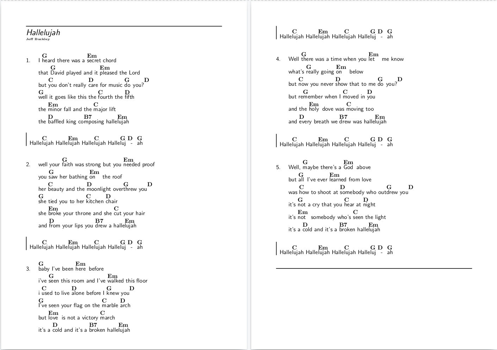
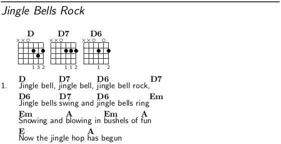
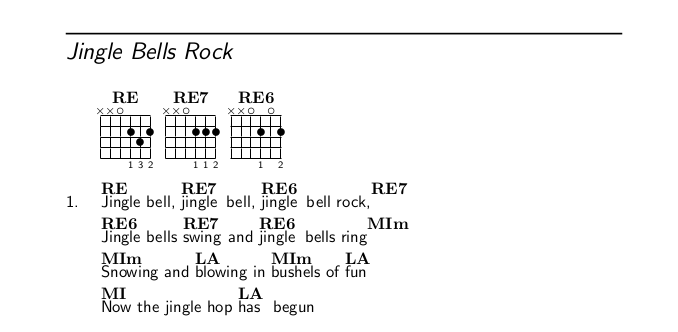
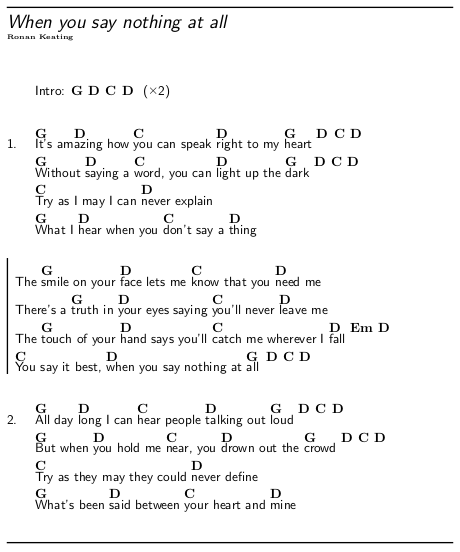

# GuitarHub
A guitar chords and lyrics booklet.

## Purpose
The primary aim of this project is to create a printable  booklet with guitar chords.

## Considerations
This book is meant mainly for the guitar player that would like to have a chords book that is updated periodically without the losage of formatting and any other related problems.
It is highly recommended to print the content of this booklet in a single-sided manner - when a new song is added you can print it out and add it to a desired location. In order to avoid inconsistencies in adding new songs to your collection, songs are not labeled with any numbers. You can, for example, order the songs alphabetically.

## Features
* The booklet is available to be printed at once, including all the songs till date. Then you can expand it by adding the newly released songs without the necessity to reprint the whole booklet.
* The format of a single sheet is ISO A5 which supports the idea of  portability.
* Each song uses at most 2 pages whilst the first page would always be an even number in such case: you haven't got any problem about reading it.  

* Write the song with alphabetic note names and then you can generate that song in both alphabetic and solfedge note names without rewriting it.  
 
* You are welcome to add your favourite songs with a pull request.
* The book is licensed by a Free Culture License.
* There is a simple template to support the writing of the song (songTemp.tex).

## Getting started
This project is written in [LaTex](https://www.latex-project.org/) with the use the [Songs package](http://songs.sourceforge.net/).

### Install a Latex environment
[Guide about the installation process of the LaTex environment](https://www.latex-project.org/get/)

### Install the Songs package
[Guide about the installation process of the Songs package](http://songs.sourceforge.net/downloads.html)

### Install a text editor or an IDE specific for LaTex document
A [text editor](https://en.wikipedia.org/wiki/Text_editor) or an IDE specific for LaTex document is useful to edit songs and the code of this book.
There are many text editors ([Atom](https://atom.io/), [Vim](https://www.vim.org/), [Emacs](https://www.gnu.org/software/emacs/)) and many IDE for LaTex ([Texmaker](http://www.xm1math.net/texmaker/), [TeXstudio](https://sourceforge.net/projects/texstudio/), [TeXworks](https://www.tug.org/texworks/)) but you can use the ones you prefer.

## songTemp.tex : a simple song template
The *songTemp.tex* is a simple template that support the writing of any song.
You don't need any special skills to write a song with this template.

### Using songTemp.tex: an example
Here you an example of a song writed by the *songTemp.tex*:  
  
```
\beginsong{%Title
When you say nothing at all}[
by={Ronan Keating} % Authors, composers, and other contributors
%,cr={} % Copyright information
%,li={} % Licensing information
%,sr={} % Related scripture references
%,index={} % An extra index entry for a line of lyrics
%,ititle={} % An extra index entry for a hidden title
]

%\capo{0}
\transpose{0} % Automatic transpositions from +0 to +12 semitones

\beginverse* % * not count the verse
	{\nolyrics Intro: \[G]\[D]\[C]\[D] \rep{2}}
\endverse

\beginverse\memorize % \memorize is used to set the chords you would like to use with ^ in the next verses
	\[G]It's am\[D]azing how \[C]you can speak \[D]right to my \[G]heart \[D]\[C]\[D]
	\[G]Without \[D]saying a \[C]word, you can \[D]light up the \[G]dark \[D]\[C]\[D]
	\[C]Try as I may I can \[D]never explain
	\[G]What I \[D]hear when you \[C]don't say a \[D]thing
\endverse
\beginchorus
	The \[G]smile on your \[D]face lets me \[C]know that you \[D]need me
	There's a \[G]truth in \[D]your eyes saying \[C]you'll never \[D]leave me
	The \[G]touch of your \[D]hand says you'll \[C]catch me wherever I \[D]fall \[Em]\[D]
	\[C]You say it best, \[D]when you say nothing at \[G]all \[D]\[C]\[D]
\endchorus
\beginverse
	^All day ^long I can ^hear people ^talking out ^loud ^^^
	^But when ^you hold me ^near, you ^drown out the ^crowd ^^^
	^Try as they may they could ^never define
	^What's been ^said between ^your heart and ^mine
\endverse

%	\textnote{} % Notes for both lyric and chorded songs
%	\musicnote{} % Notes visible only in chorded books (not visible in lyric mode)
%	\rep{n} % Repeat n times

%	Writing chords
%
% Alphabetic note names:     A      B      C      D      E      F      G
% Solfedge note names:       LA     SI     DO     RE     MI     FA     SOL
%
%	Compatible notation:
%
% Naturals:                  \[A]   \[B]   \[C]   \[D]   \[E]   \[F]   \[G]
% Flat (Bemolle):            \[A&]  \[B&]  \[C&]  \[D&]  \[E&]  \[F&]  \[G&]
% Sharp (Diesis):            \[A#]  \[B#]  \[C#]  \[D#]  \[E#]  \[F#]  \[G#]
% Minor:                     \[Am]  \[Bm]  \[Cm]  \[Dm]  \[Em]  \[Fm]  \[Gm]
% Flat and minor:            \[A&m] \[B&m] \[C&m] \[D&m] \[E&m] \[F&m] \[G&m]
% Sharp and minor:           \[A#m] \[B#m] \[C#m] \[D#m] \[E#m] \[F#m] \[G#m]

%	You can print the book with solfedge note names
%	by uncomment a line of the GuitarChords.tex:
%	```
%	%\input{SolfedgeNoteNames.tex} % Solfedge note names
%	```

\endsong
```

## Add a new song
* Copy the songTemp.tex from the repo in the right subdirectory of GuitarHub/tex/, example:
```
$ cd ./GuitarHub
$ cp songTemp.tex tex/exampleDir/
```
* Rename the copy with the title name of the song you want to write, example:
```
$ mv tex/exampleDir/songTemp.tex tex/exampleDir/Title\ song.tex
```
* Write the music (see the [documentation of the Songs package](http://songs.sourceforge.net/songsdoc/songs.html) for others useful tips)
* Add the song in a chapter input file, example:
```
$ echo '\input{"tex/exampleDir/Title song.tex"}' >> tex/exampleChapter.tex
```
Warning: this command is an example, it isn't put the song by alphabetical order.
* Add the chapter in the GuitarChords.tex, example:
```
...
\documentclass[openright]{book}
...
\usepackage[chorded]{songs}
...
\newindex{exampleChapter}{exampleChapter}
...
\begin{document}
...
\showindex[2]{Example of a Chapter}{exampleChapter} % view index
...
% New chapter
% Start on a right page and the title is in a blank page
\checkodd
\vspace*{\stretch{3}}
\songchapter{Example of a Chapter}
\vspace*{\stretch{5}}
\newpage
% Songs of this chapter
\begin{songs}{exampleChapter}
	\input{tex/exampleChapter.tex}
\end{songs}
...
\end{document}
```
* Build GuitarChords.tex (that generates the \*.sxd files, useful for indexes):
```
$ pdflatex GuitarChords.tex
```
* (Re)Generate the index:
```
$ texlua /path/to/songidx.lua exampleChapter.sxd
```
* Generate updated GuitarChords.pdf:
```
$ pdflatex GuitarChords.tex
```

## Change the note names
### Examples
* Alphabetic note names:
```
%	Remove the autogenerated files before changing the note names
%\input{SolfedgeNoteNames.tex} % Solfedge note names
```
* Solfedge note names:
```
%	Remove the autogenerated files before changing the note names
\input{SolfedgeNoteNames.tex} % Solfedge note names
```
