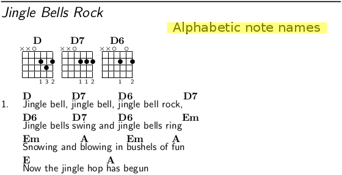

# GuitarHub
Chords and Lyrics book.

## Purpose
The primary aim of this project is to make a printable guitar chords book.

## Considerations
This book is firstly thought for the guitarists that would like to have a chords book updatable every time with new songs without losing the formatting, the ordering and any other related problems.
For this consideration it is useful that you have a ring notebook and that you print the book only on the front of the pages: when a new song will be added you can print it and then you can add it to the printed book at the right place.
To avoid inconsistencies about adding a new song in a already printed book, there isn't the songs' number: you can add a song by alphabetical order.

## Features
* Print once time the book and then update it by printing only new songs and new indexes without reprint all the book's pages.
* The format of the sheet is ISO A5 to support the portability.
* Every song use at most 2 pages and in this case the first of these pages will be an even page: you haven't got any problem about reading it.  

* Write the song with alphabetic note names and you can generate that song in both alphabetic and solfedge note names without rewriting it.  
 
* You are welcome to add your favourite songs with a pull request.
* The book is licensed by a Free Culture License.
* There is a simple template to support the writing of the song (songTemp.tex).

## Getting started
This project is written in [LaTex](https://www.latex-project.org/) and use the [Songs package](http://songs.sourceforge.net/).

### Intall a Latex environment
[Get LaTex](https://www.latex-project.org/get/)

### Install the Songs package
[Get Songs Package](http://songs.sourceforge.net/downloads.html)

### Install a text editor or an IDE specific for LaTex document
A [text editor](https://en.wikipedia.org/wiki/Text_editor) or an IDE specific for LaTex document is useful to edit songs and the code of this book.
There are many text editors ([Atom](https://atom.io/), [Vim](https://www.vim.org/), [Emacs](https://www.gnu.org/software/emacs/)) and many IDE for LaTex ([Texmaker](http://www.xm1math.net/texmaker/), [TeXstudio](https://sourceforge.net/projects/texstudio/), [TeXworks](https://www.tug.org/texworks/)) but you can use the ones you prefer.

## Simple song template
The songTemp.tex is a simple template that support the writing of any song.
You don't need any special skills to write a song with this template.
Here you an example of a song writed by the songTemp.tex:
```
\beginsong{%Title
When you say nothing at all}[
by={Ronan Keating} % Authors, composers, and other contributors
%,cr={} % Copyright information
%,li={} % Licensing information
%,sr={} % Related scripture references
%,index={} % An extra index entry for a line of lyrics
%,ititle={} % An extra index entry for a hidden title
]

%\capo{0}
\transpose{0} % Automatic transpositions from +0 to +12 semitones

\beginverse* % * not count the verse
	{\nolyrics Intro: \[G]\[D]\[C]\[D] \rep{2}}
\endverse

\beginverse\memorize % \memorize is used to set the chords you would like to use with ^ in the next verses
	\[G]It's am\[D]azing how \[C]you can speak \[D]right to my \[G]heart \[D]\[C]\[D]
	\[G]Without \[D]saying a \[C]word, you can \[D]light up the \[G]dark \[D]\[C]\[D]
	\[C]Try as I may I can \[D]never explain
	\[G]What I \[D]hear when you \[C]don't say a \[D]thing
\endverse
\beginchorus
	The \[G]smile on your \[D]face lets me \[C]know that you \[D]need me
	There's a \[G]truth in \[D]your eyes saying \[C]you'll never \[D]leave me
	The \[G]touch of your \[D]hand says you'll \[C]catch me wherever I \[D]fall \[Em]\[D]
	\[C]You say it best, \[D]when you say nothing at \[G]all \[D]\[C]\[D]
\endchorus
\beginverse
	^All day ^long I can ^hear people ^talking out ^loud ^^^
	^But when ^you hold me ^near, you ^drown out the ^crowd ^^^
	^Try as they may they could ^never define
	^What's been ^said between ^your heart and ^mine
\endverse

%	\textnote{} % Notes for both lyric and chorded songs
%	\musicnote{} % Notes visible only in chorded books (not visible in lyric mode)
%	\rep{n} % Repeat n times

%	Writing chords
%
% Alphabetic note names:     A      B      C      D      E      F      G
% Solfedge note names:       LA     SI     DO     RE     MI     FA     SOL
%
%	Compatible notation:
%
% Naturals:                  \[A]   \[B]   \[C]   \[D]   \[E]   \[F]   \[G]
% Flat (Bemolle):            \[A&]  \[B&]  \[C&]  \[D&]  \[E&]  \[F&]  \[G&]
% Sharp (Diesis):            \[A#]  \[B#]  \[C#]  \[D#]  \[E#]  \[F#]  \[G#]
% Minor:                     \[Am]  \[Bm]  \[Cm]  \[Dm]  \[Em]  \[Fm]  \[Gm]
% Flat and minor:            \[A&m] \[B&m] \[C&m] \[D&m] \[E&m] \[F&m] \[G&m]
% Sharp and minor:           \[A#m] \[B#m] \[C#m] \[D#m] \[E#m] \[F#m] \[G#m]

%	You can print the book with solfedge note names
%	by uncomment a line of the GuitarChords.tex:
%	```
%	%\input{SolfedgeNotesName.tex} % Solfedge note names
%	```

\endsong
```
The result:  


## Add a new song
* Copy the songTemp.tex from the repo in the right subdirectory of GuitarHub/tex/, example:
```
$ cd ./GuitarHub
$ cp songTemp.tex tex/exampleDir/
```
* Rename the copy with the title name of the song you want to write (avoid special carachters and spaces), example:
```
$ mv tex/exampleDir/songTemp.tex tex/exampleDir/Title\ song.tex
```
* Write the music (see the [documentation of Songs package](http://songs.sourceforge.net/songsdoc/songs.html) for others useful tips)
* Add the song in a chapter input file, example:
```
$ echo '\input{"tex/exampleDir/Title song.tex"}' >> tex/exampleChapter.tex
```
Warning: this command is an example, it isn't put the song by alphabetical order.
* Add the chapter in the GuitarChords.tex, example:
```
...
\documentclass[openright]{book}
...
\usepackage[chorded]{songs}
...
\newindex{exampleChapter}{exampleChapter}
...
\begin{document}
...
\showindex[2]{Example of a Chapter}{exampleChapter} % view index
...
% New chapter
% Start on a right page and the title is in a blank page
\checkodd
\vspace*{\stretch{3}}
\songchapter{Example of a Chapter}
\vspace*{\stretch{5}}
\newpage
% Songs of this chapter
\begin{songs}{exampleChapter}
	\input{tex/exampleChapter.tex}
\end{songs}
...
\end{document}
```
## Change the note names
### Examples
* Alphabetic note names:
```
%	Remove the autogenerated files before changing the note names
%\input{SolfedgeNotesName.tex} % Solfedge note names
```
* Solfedge note names:
```
%	Remove the autogenerated files before changing the note names
\input{SolfedgeNotesName.tex} % Solfedge note names
```
